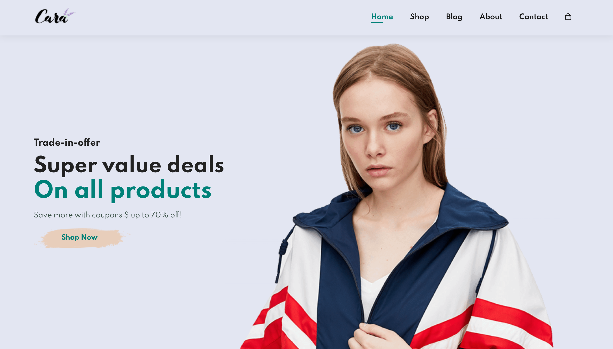
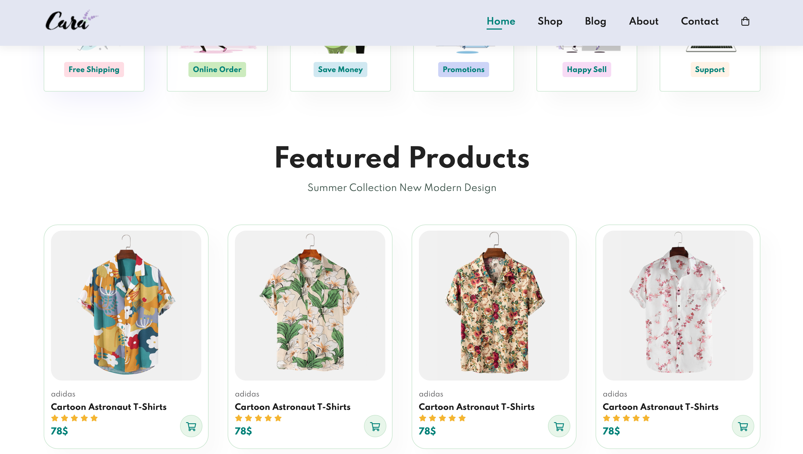

[caracollections](https://caracollections.netlify.app/)
# CaraCollections

Welcome to CaraCollections, your go-to destination for stylish and unique fashion finds! 🛍️ Explore a curated collection of the latest trends and must-have items. This e-commerce store is built with JavaScript, HTML, CSS, and enhanced with Font Awesome icons for a sleek and modern shopping experience.

## Table of Contents

- [Demo](#demo)
- [Features](#features)
- [Technologies](#technologies)
- [Installation](#installation)
- [Usage](#usage)
- [Folder Structure](#folder-structure)
- [Contributing](#contributing)
- [License](#license)

## Demo




[Live Demo](https://caracollections.netlify.app/)

## Features

- **Stylish Design**: A visually appealing and user-friendly interface for an enjoyable shopping experience.
- **Responsive Layout**: Seamlessly browse and shop from any device, ensuring a consistent experience.
- **Product Showcase**: Highlight featured products with detailed descriptions and high-quality images.
- **Shopping Cart Functionality**: Add and manage items in the cart for easy checkout.
- **Font Awesome Icons**: Enhance the visual elements with a library of scalable vector icons.
- **Search Functionality**: Quickly find your desired items with the search feature.

## Technologies

- **JavaScript**: The primary programming language for dynamic and interactive functionality.
- **HTML**: Structure the web pages and content.
- **CSS**: Style the components and create a visually appealing layout.
- **Font Awesome**: Incorporate a diverse set of icons for improved visual elements.

## Installation

1. Clone the repository:

   ```bash
   git clone https://github.com/Oxygeeeen/CaraCollections.git
   ```

2. Navigate to the project directory:

   ```bash
   cd CaraCollections
   ```

3. Open the `index.html` file in your preferred browser.

## Usage

- Browse the product catalog.
- Add items to the shopping cart.
- Proceed to checkout and enjoy a seamless shopping experience!

## Folder Structure

```plaintext
/CaraCollections
  ├── index.html
  ├── (...).html
  ├── style.css
  ├── script.js
  ├── images/
  │   ├── product1.jpg
  │   └── ...
  ├── .gitignore
  ├── package.json
  └── README.md
```

## Contributing

1. Fork the repository.
2. Create a new branch: `git checkout -b feature-name`.
3. Make your changes and commit them: `git commit -m 'Add some feature'`.
4. Push to the branch: `git push origin feature-name`.
5. Open a pull request.

## License

This project is licensed under the [MIT License](https://opensource.org/licenses/MIT). Feel free to explore, contribute, and use it in your projects.

```
Happy shopping! 🛒✨
```
